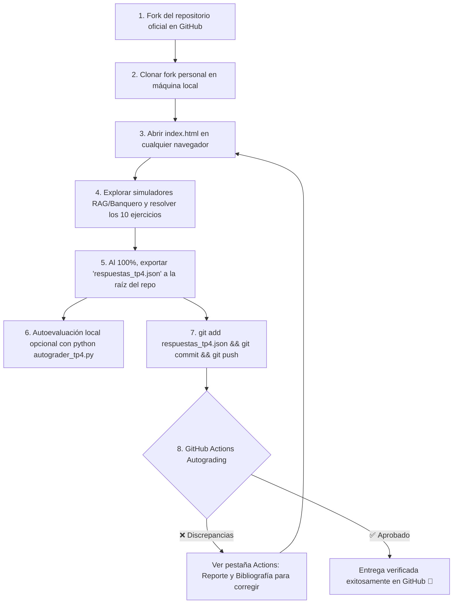

# 🎓 Trabajo Práctico N° 4: Gestión de Recursos e Interbloqueos (Deadlocks)
## Cátedra: Teoría de Sistemas Operativos (TSO) — Ciclo Lectivo 2026
### Universidad Nacional de Jujuy (UNJu) — Facultad de Ingeniería


---

## 🏛️ Información Institucional y Equipo Docente

- **Institución:** Universidad Nacional de Jujuy (UNJu) — Facultad de Ingeniería (FI).
- **Carreras:** Ingeniería Informática / Licenciatura en Sistemas.
- **Asignatura:** Teoría de Sistemas Operativos (TSO).
- **Ciclo Lectivo:** 2026.
- **Profesora Titular / Responsable de Cátedra:** Ing. María Fernanda Vázquez.
- **Jefe de Trabajos Prácticos (JTP):** Ing. Fabio D. Argañaraz.
- **Modalidad:** Estrictamente **individual**, autoevaluativo con exportación a JSON estructurado y entrega mediante **Git / GitHub Classroom**.
- **Organización Oficial en GitHub:** [https://github.com/UNJU-Teoria-de-Sistemas-Operativos](https://github.com/UNJU-Teoria-de-Sistemas-Operativos)
- **Repositorio Template:** [https://github.com/UNJU-Teoria-de-Sistemas-Operativos/TP4](https://github.com/UNJU-Teoria-de-Sistemas-Operativos/TP4)

---

## 🎯 Objetivos Pedagógicos

Al finalizar este Trabajo Práctico, el estudiante será capaz de:

1. **Identificar las Condiciones de Interbloqueo:** Analizar las cuatro condiciones necesarias de Coffman (*Exclusión Mutua*, *Retener y Esperar*, *No Expropiación* y *Espera Circular*) y aplicar las técnicas clásicas para su prevención estática.
2. **Modelar Sistemas mediante Grafos de Asignación de Recursos (RAG):** Construir e interpretar grafos bipartitos dirigidos, reconociendo cuándo la presencia de un ciclo constituye una condición suficiente (recursos de instancia única) o meramente necesaria (recursos de múltiples instancias).
3. **Dominar el Algoritmo del Banquero (Dijkstra):** Formular matrices de Asignación, Demanda Máxima y Necesidad ($\text{Need} = \text{Max} - \text{Allocation}$). Evaluar vectores de Trabajo ($\text{Work}$) y Finalización ($\text{Finish}$) para descubrir secuencias seguras y decidir la viabilidad de solicitudes dinámicas de recursos.
4. **Aplicar Métodos de Reducción de Grafos:** Determinar la existencia de bloqueos mediante la eliminación iterativa de procesos no bloqueados y la liberación de sus recursos asignados.
5. **Detectar Interbloqueos en Sistemas Multi-Instancia:** Operar el algoritmo de detección matricial de Silberschatz/Stallings cuando no se dispone de declaraciones previas de máximos.
6. **Implementar Estrategias de Recuperación:** Seleccionar procesos víctimas según criterios de costo, prioridad y recursos retenidos para restaurar el sistema a un estado libre de bloqueos.
7. **Diseñar Estrategias Combinadas:** Integrar esquemas de prevención, evitación y detección mediante clases jerárquicas y ordenamiento lineal de recursos.
8. **Utilizar Flujos de Integración Continua (CI):** Gestionar el código con Git, resolver consignas en la aplicación web interactiva con simuladores visuales y verificar la aprobación automática mediante GitHub Actions.

---

## 📚 Mapeo Bibliográfico Obligatorio por Capítulo

Cada ejercicio del práctico está directamente correlacionado con los libros oficiales de la cátedra disponibles en el Aula Virtual y las presentaciones de la Profesora Titular:

| Ejercicio | Tema Principal | Laboratorio y Preset Asociado | Bibliografía Oficial de Cátedra |
| :---: | :--- | :--- | :--- |
| **Ej 1** | Algoritmo del Banquero: Matriz Necesidad y Tabla de Ejecución | 🏦 **Banco de Dijkstra** &rarr; `Cargar Escenario Ejercicio 1 (A,B,C,D)` | • **Diapositivas Cátedra:** Clase 5 - Unidad 4, Diap. 23–25.<br>• **Silberschatz (7ma Ed.):** Cap. 7.5.3 (pp. 265–267).<br>• **Stallings (5ta Ed.):** Cap. 6.3 (pp. 266–271). |
| **Ej 2** | Identificación de Riesgos y Condiciones de Coffman | 🏦 **Banco de Dijkstra** (`Escenario Ej. 1`) + 🕸️ **RAG Studio** (`Preset Ciclo`) | • **Diapositivas Cátedra:** Clase 5 - Unidad 4, Diap. 5 y 12.<br>• **Silberschatz:** Cap. 7.1–7.4 (pp. 257–264).<br>• **Stallings:** Cap. 6.1–6.2 (pp. 255–266). |
| **Ej 3** | Solicitud Dinámica de P1(0,3,0,0) y Estado Inseguro | 🏦 **Banco de Dijkstra** &rarr; `Escenario Ej. 1` + Botón `🧪 Test Solicitud Dinámica` | • **Diapositivas Cátedra:** Clase 5 - Unidad 4, Diap. 26.<br>• **Silberschatz:** Cap. 7.5.4 (pp. 267–268).<br>• **Tanenbaum (3ra Ed.):** Cap. 6.5.3 (pp. 450–454). |
| **Ej 4** | Reducción Práctica de Grafos de Asignación | 🕸️ **RAG Studio** &rarr; `Preset Ejercicio 2` + Botón `⚡ Reducir Grafo` | • **Diapositivas Cátedra:** Clase 5 - Unidad 4, Diap. 32–35.<br>• **Carretero:** Cap. 4.5.1 (pp. 142–145).<br>• **Stallings:** Cap. 6.4 (pp. 271–273). |
| **Ej 5** | Modelado a partir del Grafo RAG (Instancia Silberschatz) | 🕸️ **RAG Studio** &rarr; Botón `Preset Silberschatz` (Lienzo SVG) | • **Diapositivas Cátedra:** Clase 5 - Unidad 4, Diap. 27.<br>• **Silberschatz:** Cap. 7.5.3 (pp. 265–267).<br>• **Carretero:** Cap. 4.4 (pp. 140–142). |
| **Ej 6** | Evaluación de Solicitudes Dinámicas en RAG Clásico | 🏦 **Banco de Dijkstra** &rarr; Botón `Cargar Escenario Silberschatz (A,B,C)` | • **Diapositivas Cátedra:** Clase 5 - Unidad 4, Diap. 27.<br>• **Silberschatz:** Cap. 7.5.3 (pp. 265–267).<br>• **Carretero:** Cap. 4.4 (pp. 140–142). |
| **Ej 7** | Detección de Bloqueos en Sistemas Multi-Instancia | 🔍 **Algoritmo de Detección Matricial** (Silberschatz Cap. 7.6.2) | • **Diapositivas Cátedra:** Clase 5 - Unidad 4, Diap. 36–39.<br>• **Silberschatz:** Cap. 7.6.2 (pp. 269–271).<br>• **Stallings:** Cap. 6.4 (pp. 271–274). |
| **Ej 8** | Recuperación por Selección de Víctima (Prioridades) | 🎯 **Selección de Víctima** (Derivado del Deadlock de Ejercicio 7) | • **Diapositivas Cátedra:** Clase 5 - Unidad 4, Diap. 40–44.<br>• **Silberschatz:** Cap. 7.7 (pp. 271–274).<br>• **Tanenbaum:** Cap. 6.5.4 (pp. 454–456). |
| **Ej 9** | Solicitud de P2(1,1,0,0) y Actualización Matricial | 🔄 **Solicitud y Re-detección** (Sobre el estado base de Ejercicio 7) | • **Diapositivas Cátedra:** Clase 5 - Unidad 4, Diap. 26 y 37.<br>• **Silberschatz:** Cap. 7.5.4 y 7.6.<br>• **Stallings:** Cap. 6.4 (pp. 271–274). |
| **Ej 10** | Estrategias Combinadas y Jerarquía Lineal de Recursos | 📚 **Síntesis Teórica de Cátedra** (Partición modular y orden lineal) | • **Diapositivas Cátedra:** Clase 5 - Unidad 4, Diap. 47.<br>• **Silberschatz:** Cap. 7.8 (pp. 274–275).<br>• **Stallings:** Cap. 6.6 (pp. 276–278). |

---

## 🏗️ Estructura del Repositorio

```text
TP4/
├── .github/
│   └── workflows/
│       └── classroom.yml      # Workflow de GitHub Actions (Autograding CI disparado por push)
├── index.html              # Aplicación web con simuladores RAG y Banquero + 10 ejercicios interactivos
├── styles.css              # Sistema visual Glassmorphism, temas Dark/Light, diagramas SVG y matrices
├── app.js                  # Motor de interacción reactivo, SortableJS, SVG RAG, Banquero y exportador JSON
├── rubric_tp4.json         # Rúbrica pública protegida con hashes SHA-256 salteados de cátedra
├── autograder_tp4.py       # Script autoevaluador en Python 3 para consola y GitHub Actions
├── README.md               # Guía del estudiante y documentación oficial
└── .gitignore              # Excluye matrices master docentes y caches temporales
```

---

## 🚀 Flujo de Trabajo del Estudiante (Paso a Paso)



### 1. Fork y Clonado
1. Ingresa al repositorio oficial de la cátedra: [https://github.com/UNJU-Teoria-de-Sistemas-Operativos/TP4](https://github.com/UNJU-Teoria-de-Sistemas-Operativos/TP4).
2. Pulsa en el botón **Fork** (esquina superior derecha) para crear tu repositorio personal.
3. Clona tu fork en tu entorno local:
   ```bash
   git clone https://github.com/TU_USUARIO/TP4.git
   cd TP4
   ```

### 2. Resolución Interactiva
1. Abre `index.html` haciendo doble clic en tu navegador web preferido (no requiere internet ni instalación previa).
2. Completa tu **Nombre**, **DNI/Legajo** y **Usuario de GitHub** en la cabecera.
3. Utiliza los dos laboratorios visuales integrados:
   - **RAG Studio (Lienzo SVG):** Para trazar procesos, recursos y detectar ciclos o reducciones paso a paso.
   - **Simulador del Algoritmo del Banquero:** Para verificar estados seguros y testear solicitudes dinámicas.
4. Resuelve los 10 ejercicios interactivos (el progreso se autoguarda instantáneamente en `localStorage`).

### 3. Exportación y Entrega
1. Al completar los 10 ejercicios y registrar tus datos personales, se activará el botón **"💾 Exportar Respuestas (.json)"**.
2. Descarga `respuestas_tp4.json` y asegúrate de ubicarlo en la **raíz de tu repositorio local**.
3. *(Opcional)* Si cuentas con Python 3 instalado, puedes autoevaluarte localmente:
   ```bash
   python autograder_tp4.py respuestas_tp4.json
   ```
4. Sube tu entrega a GitHub:
   ```bash
   git add respuestas_tp4.json
   git commit -m "Entrega TP4 - [Tu Nombre y Apellido]"
   git push origin main
   ```

### 4. Calificación en GitHub Actions
Inmediatamente tras el `push`, el sistema de CI de GitHub evaluará tu entrega:
- **Badge Verde (`✅ Check`)**: Has obtenido una calificación aprobatoria (≥ 4.0 / 10).
- **Badge Rojo (`❌ Cruz`)**: Se detectaron discrepancias. Haz clic sobre la acción o dirígete a la pestaña **Actions** para consultar la tabla detallada y las referencias bibliográficas que debes repasar antes de reenviar.

---

## ⚖️ Criterios de Aprobación

- **Puntaje Máximo:** 100 puntos (Escala 0 a 10).
- **Nota Mínima de Aprobación:** 4.0 / 10 (40 puntos).
- **Rúbrica Criptográfica (Zero-Knowledge):** La evaluación se computa localmente o en la nube mediante hashes SHA-256 salteados (`rubric_tp4.json`), evitando la filtración de soluciones en texto claro y garantizando rigor académico.
